📈 Stock Market Simulator

A simple command-line based stock market simulator written in C++. This project allows users to buy and sell stocks using virtual currency while simulating changes in stock prices over time. It serves as a learning project to understand basic C++ concepts like file handling, arrays, conditionals, loops, and user interaction.

## Features

- Simulated stock trading (buy/sell)
- Virtual wallet for managing funds
- Randomized stock price fluctuations
- Portfolio tracking
- Easy-to-understand logic for beginners

## Technologies Used

- **Language:** C++
- **Compiler:** g++ or any standard C++ compiler
- **Platform:** Command Line Interface (CLI)

## 📂 Project Structure

```

📁 Stock-Market-Simulator/
├── main.cpp           # Main source code
├── output.exe         # Executable for Windows (precompiled)

````

## Getting Started

### 1. Clone the Repository
```bash
git clone https://github.com/aazannoorkhuwaja/Stock-Market-Simulator.git
cd Stock-Market-Simulator
````

### 2. Compile the Code

Using g++:

```bash
g++ main.cpp -o stock_simulator
```

### 3. Run the Simulator

```bash
./stock_simulator
```

## Usage

* Start the simulator.
* Choose options from the menu (Buy, Sell, View Portfolio, Exit).
* Follow prompts to make trades.
* Watch stock prices change over time.
  
## 📸 Screenshots

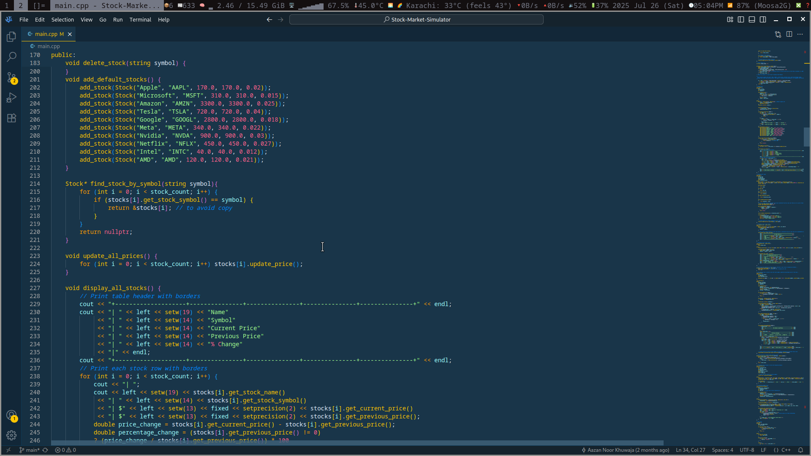
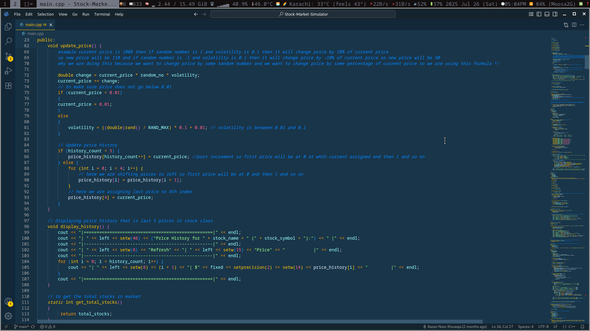
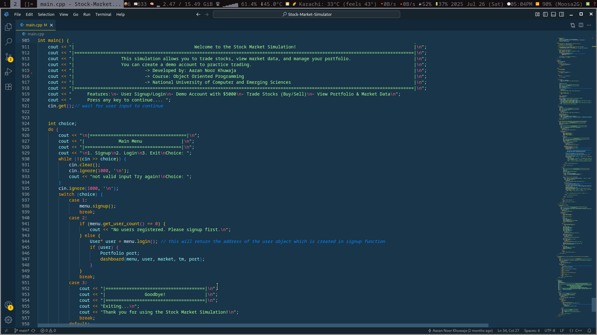
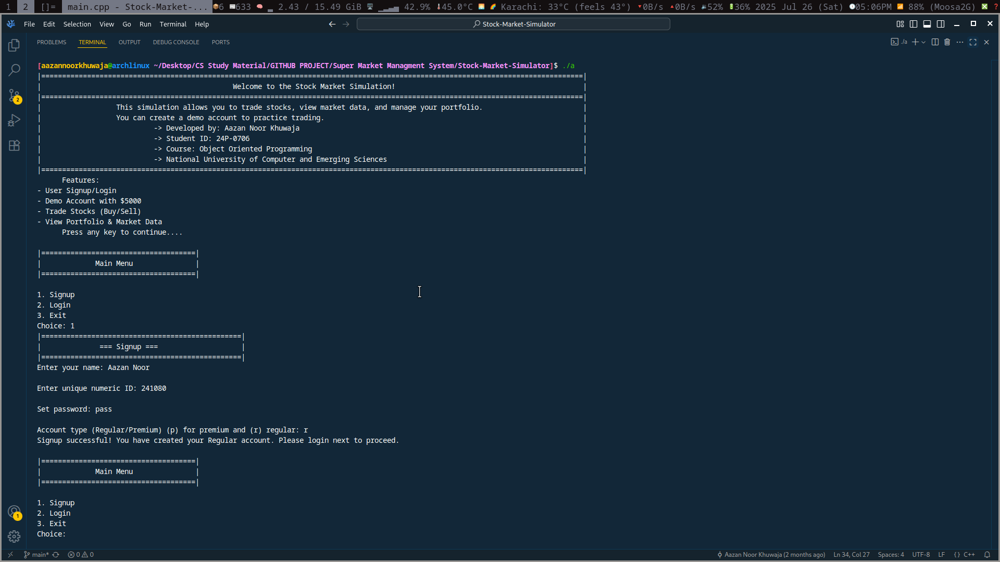
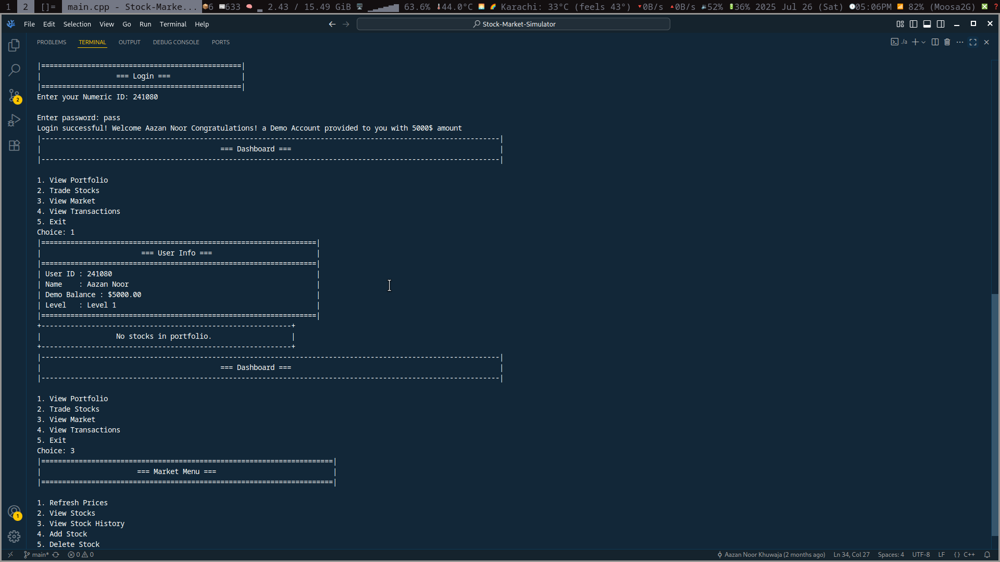
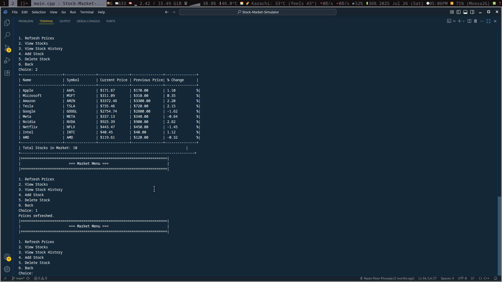
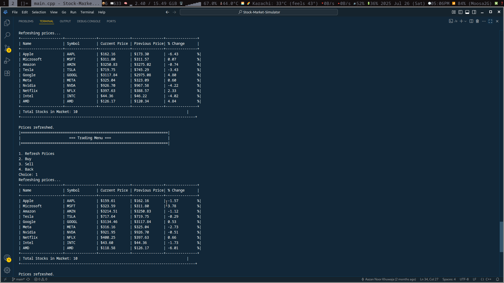
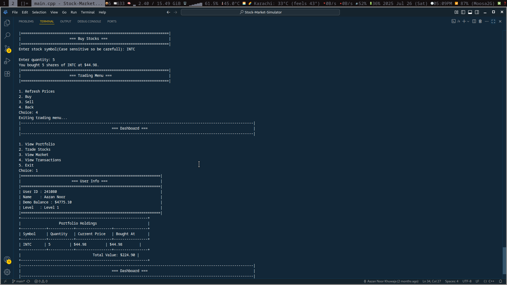
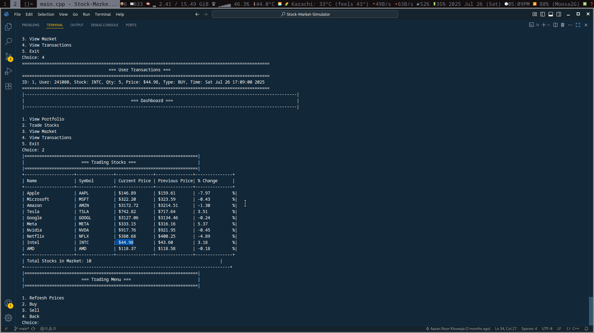
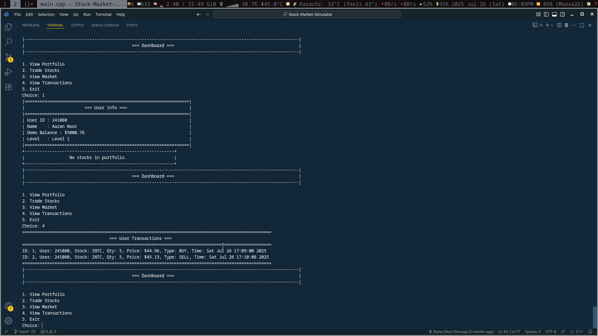
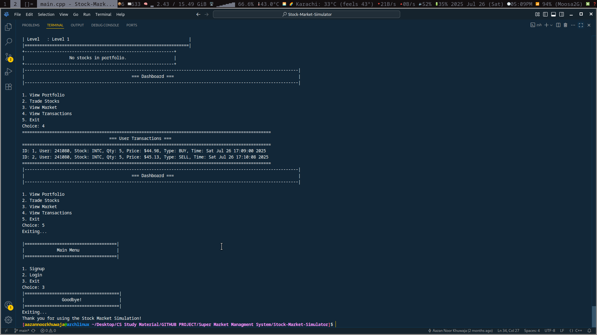


## Purpose of the Project

This project was created for learning purposes to strengthen core C++ concepts such as:

* Conditional statements
* Loops
* Arrays and data structures
* Input/output formatting
* Real-world application logic

## 🤝 Contributing

Contributions are welcome! Feel free to fork the repository and open a pull request with suggestions or improvements.

---

### 👤 Author

- **Aazan Noor Khuwaja**
- **Object-Oriented-Programing-Project**
- **National University Of Computer and Emerging Sciences**
- [LinkedIn Profile](https://www.linkedin.com/in/aazan-noor-khuwaja-cs/)
- [aazannoorkhuwajagmail.com](mailto:aazannoorkhuwaja@gmail.com)
